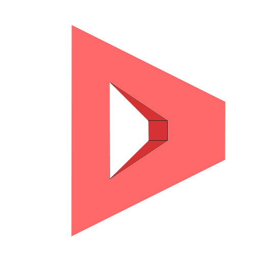

  

#  Dosh Privacy Cryptocurrency

### Open Source Decentralized Blockchain

The advent of Dosh is a coherent outcome to the prerequisite for more decentralized untraceable digital cash. 

  Dosh enables a quick and easy way to transact privately on the bases of equally privileged peer-to-peer transactions over the network, empowering participants to share and practice their own Freedom: privately and anonymously at wish.
  	
  The Underpinning of the new Cryptocurrency is an open source CryptoNote protocol, utilizing CryptoNight proof-of-work hashing algorithm to provide a secure network that provides private & anonymous transactions for all participants.

  Privacy is a fundamental human right and our endeavour is to establish Dosh as a truly Decentralized Cryptocurrency with an Egalitarian proof-of-work voting system where every participant has an equal vote within the network.

  Our vision is to create: An equitable decentralized Cryptocurrency featured with fast and secure means of direct payment for individuals who believe in freedom, independence and fairness.

                 *Join our growing Dosh community
  

### Egalitarian Votes

Dosh is based on an Egalitarian proof-of-work that acts as a voting system, thus is fairly distributed per vote without any special privileges. Everyone is invited to join our network and start mining to secure all transactions on the Blockchain. No coin being *premined, *instamined or any additional imposed interest percentage on coin mining (mining tax), a truly honest proof-of-work.

### Anonymous Transactions

The most important aspect of our objectives is to make all transactions on the Dosh network anonymous and untraceable. The CryptoNote protocol provides all participants with a fully anonymous payment system through adopting Ring Signatures to render all payments indistinguishable and untraceable, thus accepting or spending Dosh doesn't have the risks of being tracked, blacklisted or even censored. Dosh is fungible making all values interchangeable, allowing coins to be used without a trace or link. The whole point of Dosh is to decouple money from being centrally controlled for the good of individuals, organizations and even governments.

       *Info

    •	Date of Announcement: 15th Feb 2018
    •	Date of Launch: 1st March 2018
    •	Total number of coins: 18.4 Million Dosh.
    •	Consensus Mechanism: Proof-of-work.
    •	Hashing Algorithm: CryptoNight.
    •	Forked from: Bytecoin.
    •	Block time confirmation: 120 Seconds (2 Minutes).
    •	Supported Platforms: Linux, Windows.
    •	Mining Hardware: GPU and CPU only.

       *Features                                      

    •	True anonymity and data protection.
    •	Untraceable distributed payments employing ring signatures.
    •	Unlinkable transactions with random data transfer by the sender.
    •	Double spending protection.
    •	Adaptive Parameters. 
    •	Blockchain analysis resistant.
    •	Egalitarian proof-of-work, Dosh is ASIC resistant

      

## CryptoNight proof-of-work
  
  Anyone can mine Dosh using a consumer graphics processing unit (GPU) and central processing unit (CPU). CryptoNight is a proof-of-work algorithm that creates a system resistant to both application-specific integrated circuits (ASICs) and fast memory-on-chip devices. This is designed to create a more uniform distribution of coins through the currency's life. User are not limited on the type of hardware they can use to mine Dosh. Being ASIC resistant means that Dosh gains consensus through a more decentralized and distributed network of hashing power.

## Open source

  Dosh is open source, meaning anyone is welcome to review and contribute to the project. Everyone is welcome to participate in the future development of Dosh. Check out our Github link and come join the community. 

## What is CryptoNote?
 
  CryptoNote is an application layer protocol that powers Dosh, a decentralized privacy oriented digital currency.
 Transactions executed by CryptoNote cannot be followed through the blockchain in a way that reveals who sent or received the coins. The approximate amount of a transaction can be known, but the origin, destination, or actual amount cannot be learned. The only information available is that the actual amount was lower than the displayed amount. The only people with access to the whole set of data about a transaction are the sender or receiver of the transaction and the person who possesses one or both private keys.

  Two of the main features of CryptoNote are ring signatures that mask sender identities by mixing and one-time keys that make transactions unlinkable. Their combined effect gives a high degree of anonymity without any extra effort on the part of the user.

## Blockchain analysis resistance

  Dosh prevents any type of blockchain analysis on the network. Users are free to send and receive Dosh whilst maintaining their privacy.

  Blockchain Analysis: the ability of tracing the money flow, identify the owners of the coins, determine wallet balances. The ability to make such analysis is due to the fact that all the transfers between addresses are transparent: every input in a transaction refers to a unique output. Moreover, users often re-use their old addresses, receiving and sending coins from them many times, which simplifies the analyst’s work. It happens unintentionally: if you have a public address for example ( donations ), you are sure to use this address in many inputs and transactions.

## Ring signatures

  A ring signature is a type of digital signature that can be performed by any member of a group of users that each have keys. Therefore, a message signed with a ring signature is endorsed by someone in a particular group of people. One of the security properties of a ring signature is that it should be computationally infeasible to determine which of the group members' keys was used to produce the signature.

### Dosh Denominations

    Name          Base 10           Amount
    
     
    Bob           10^-12            0.000000000001
    
    Nanodosh      10^-9             0.000000001
    Microdosh     10^-6             0.000001
    Millidosh     10^-3             0.001
    Centidosh     10^-2             0.01
    Decidosh      10^-1             0.1
    
    Dosh          1
     
    Decadosh      10^1              10
    Hectodosh     10^2              100
    Kilodosh      10^3              1,000
    Megadosh      10^6              1,000,000

### Freedom, Independence and Fairness.
 
 
           Everyone is welcome to join our community.
           
           *We endeavour to keep Dosh anonymous & uncensored,
           hence we choose not to create a fancy website hosted on a centralized entity.
           Dosh is a Cryptocurrency, no more no less.*
           
           
 

  

  
  Telegram: t.me/doshcurrency
  
  Bitcoin talk: https://bitcointalk.org/index.php?topic=2958573.0
  
  Twitter : @doshprivacy
  
  ## DOSH is your Currency

